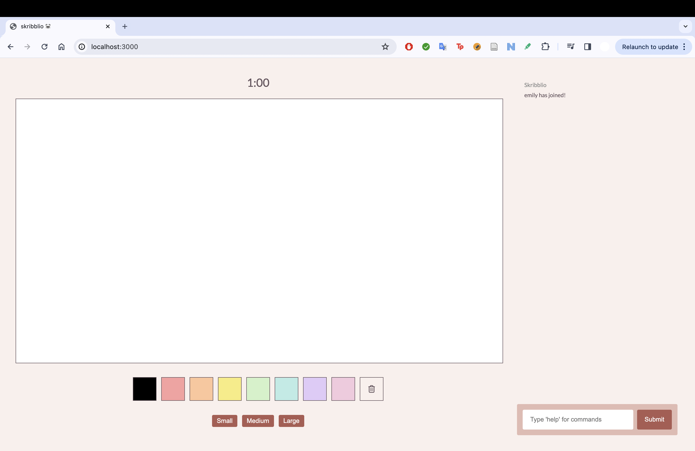
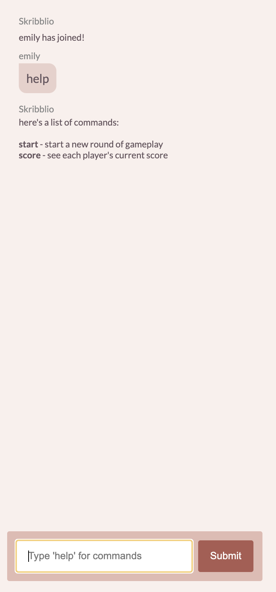
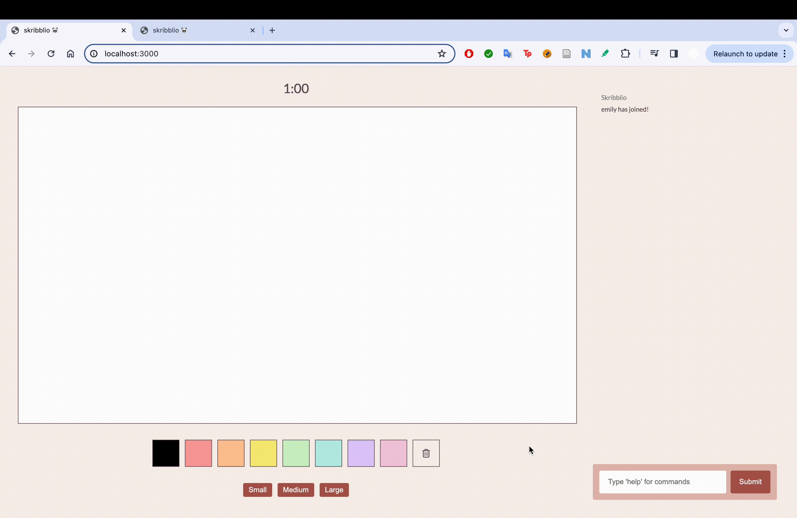
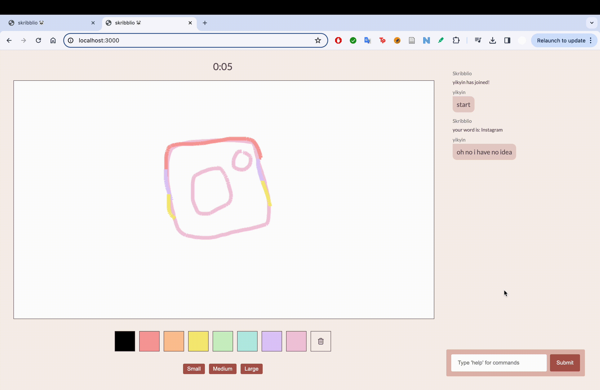
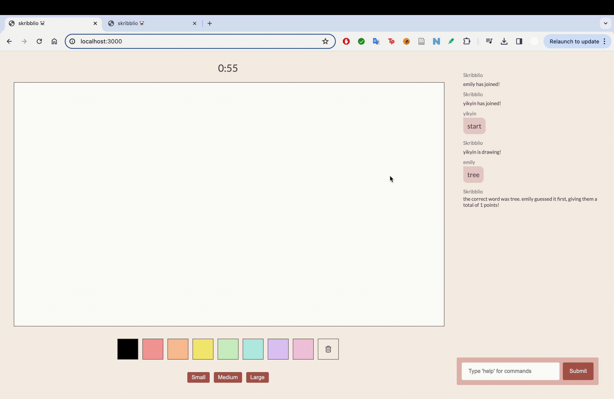

## 👩🏻‍💻 DESCRIPTION
Welcome to `skribbl.io 🎨`, a digital rendition of the classic game of pictionary, where players utilize a chatroom to guess answers and control gameplay. This project was heavily inspired by the popular online game, [**skribbl.io**](https://skribbl.io/).

`skribbl.io` was made by [@00eemsy](https://github.com/00eemsy) (Emily) and [@ycheuk](https://github.com/ycheuk) (Yik Yin) as part of our 2024 Reed Hackathon. We both worked on all aspects of the project, but broadly speaking Emily focused more on implementing client-server interactions and Yik Yin focused more on stylization/frontend functionality. This hackathon acted as an introduction to HTML, CSS, JavaScript, web development, client-server interactions, etc., and `skribbl.io` was the capstone of our week-long learning experience!

This game was created with HTML/CSS/JavaScript, with the help of runtime environments/frameworks/etc. such as [Node.js](https://nodejs.org/en), [Express.js](https://expressjs.com/), and [Socket.IO](https://socket.io/) for our backend

⬇️ opening still of `skribbl.io`


## 💡 INSTRUCTIONS 
⬇️ `help` command of `skribbl.io`
<br>

* Type commands directly into the chatbox
* After starting a round (with the `start` command)
  * The chat will choose a random player as that round's drawer and will give them a keyword to draw out
  * Using the canvas's different pen colors and widths, the drawer will be given 1 minute to draw out their keyword
  * Using the chat, other players will type their guesses into the chat
  * The first one to guess the word gets a point added to their score!
  * If no one guesses it, the round is null and no one gains a point
 
### Other Details 🌟
* When someone's selected as the drawer, no one else can draw on the canvas. When `start` hasn't been activated, anyone can draw on the canvas
* When you first join the server, you're prompted to make your own username
* The chat announces when a user connects/disconnects
 
##  📦 INSTALLING AND RUNNING 
1. From [ycheuk/skribblio](https://github.com/ycheuk/skribblio), download the following files:
    * `app.js` (the server-facing js code)
    * `index.html`
    * the `public` folder, which includes:
        * `style.css`
        * `script.js`(the client-facing js code)
2. Also make sure to have Node.js and Express.js installed on your device ([link](https://nodejs.org/en/download/current) to installing Node.js, [link](https://expressjs.com/en/starter/installing.html) to installing Express.js)
3. Using your preferred console, type the following:
```
node app.js
```
4. Open the following link on your preferred browser: [https://localhost:3000](https://localhost:3000)

## 🎮 DEMOS 
_using the chat_


_a round of gameplay_


running out of time


`score` feature

  
